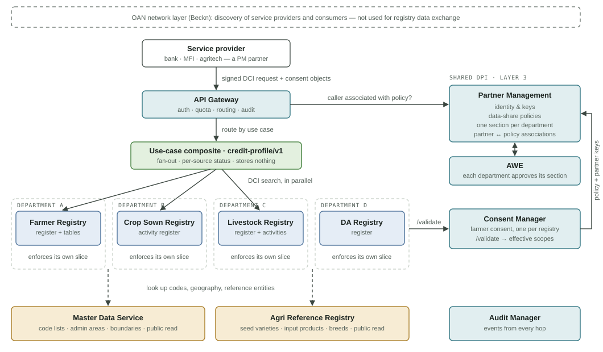

# Agri Stack data sharing

How a service provider (SP) gets farmer data that sits in several departmental registries: who routes the request, who decides what may be shared, and who enforces it.

These pages record where the design discussion has landed for OAN Ethiopia layers 1–3. Apart from the existing OpenG2P registries, Partner Management (PM) and Consent Manager (CM), none of this is built yet.

| Page | Covers |
|---|---|
| [This page](#components-and-who-talks-to-whom) | Components and who talks to whom |
| [Request flow](request-flow.md) | One request, end to end |
| [Use-case composite](composite.md) | How a composite use case is configured, validated and run |
| [Policy and consent](policy-and-consent.md) | What gets released; policy vs use case vs consent |
| [Consent model](consent-model.md) | One consent for the partner, one grant per registry inside CM (proposed) |
| [Registry model](registry-model.md) | Register, table and activity-register kinds; projections; Layer 2 split |
| [Activity register](activity-register.md) | Append-only activity registers (attendance, crop sown): changes and new features needed in the registry platform |
| [Open items](open-items.md) | Decisions and checks still pending |

## Components and who talks to whom

| Colour | Layer |
|---|---|
| Blue | Layer 1: functional registries (system of record) |
| Ochre | Layer 2: reference / master data (all in MDS) |
| Teal | Layer 3: shared DPI |
| Green | Layer 4: use-case service |

Every registry sends `/validate` to the Consent Manager; the single arrow in the diagram stands for all four. The gateway routes requests but never reads data. The composite runs only for approved use cases and keeps nothing after it responds. Beckn appears only at the OAN network layer, for discovering service providers and consumers. It isn't used to exchange registry data.

> **Note:** the diagram labels CM as "farmer consent, one per registry". The [consent model](consent-model.md) proposes changing this: the partner requests and receives **one consent**, and CM holds a grant per registry inside it.

### Who does what

- **Partner Management (one instance).** The trust root for every participant: service providers, registries and composites. It also holds the **data-share policies** (moved here from CM), split into one section per department, and records which partners are associated with each policy.
- **Consent Manager (one instance).** Holds the farmer's individual consent. `/validate` returns what the farmer consented to, intersected with the calling registry's policy section.
- **Registries (one per department).** Each one is sovereign: it checks the caller, calls `/validate`, and releases only the effective scopes. All of them are keyed to the same Fayda-based identifier.
- **API gateway and composites.** The gateway is the single public entry point. Data from several registries is merged only in narrow composite services built for one purpose each, such as `credit-profile`. There is no general query engine across registries. Each use case is a configuration file loaded by one generic composite service (see [Use-case composite](composite.md)).
- **AWE.** Each department approves its own section of a policy.
- **Audit Manager.** Receives audit events from every hop, linked by the request ID.

### Why not X-Road, IUDX or a data-space connector

- **X-Road** secures transport between organisations, but it has no consent handling, field-level policy or aggregation. It's only worth adding if the government mandates a national interoperability layer. In that case it would carry the DCI calls, and everything described here would sit on top unchanged.
- **IUDX** is out of scope.
- **Eclipse Dataspace Components** duplicate PM and CM and bring a heavy Java stack. We borrow only their vocabularies: DCAT and ODRL.
